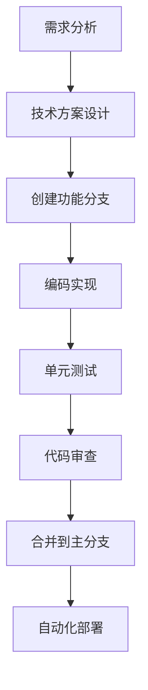

# seemse-ai-web

[English](./README_EN.md) | 简体中文


🚀 **版本**: v2.0.0 | 📅 **更新日期**: 2025年12月 | 🌐 **项目地址**: [https://github.com/seemse/seemse-ai-web.git](https://github.com/seemse/seemse-ai-web.git)

一款**基于 Vue 3 + TypeScript**开发的现代化 AI 聊天应用前端，专为「智能对话 + 多模态 AI 能力」场景深度优化。集成 ChatGPT、Midjourney、语音交互等核心功能，支持「企业级部署、权限管控、国际化」等高级特性，为开发者提供「开箱即用」的 AI 应用前端解决方案。

## 📚 项目生态

Seemse AI 是一套完整的人工智能解决方案，包含以下核心项目：

- **后端项目** : [https://github.com/seemse/seemse_ai](https://github.com/seemse/seemse_ai) 
  - 基于 Spring Boot + MyBatis Plus 构建的AI服务后端
  - 提供用户管理、AI模型管理、对话处理等核心API服务
  - 支持多种AI模型集成（OpenAI、Claude、文心一言等）

- **管理端地址** : [https://github.com/seemse/seemse-ai-admin](https://github.com/seemse/seemse-ai-admin)  
  - 基于 Vue 3 + Ant Design Vue 的企业级管理后台
  - 提供用户管理、系统配置、AI模型配置、数据统计等功能
  - 支持权限管理、系统监控、日志管理等企业级特性

- **聊天应用前端地址** : [https://github.com/seemse/seemse-ai-web](https://github.com/seemse/seemse-ai-web)
  - 基于 Vue 3 + TypeScript 的现代化聊天应用
  - 支持多模型对话、历史记录、文件上传等功能
  - 响应式设计，支持PC端和移动端访问

## 🔗 项目由来

本项目基于现代前端技术栈独立开发，专注于提供**轻量级、高可用、易扩展**的 AI 应用前端解决方案。采用**前后端分离架构**，支持与多种后端服务无缝对接，特别适合以下场景：

* **企业级 AI 应用**：支持私有化部署、权限管控、数据安全
* **多模态 AI 交互**：集成文本、图像、语音等多种 AI 能力
* **快速产品原型**：提供完整的 UI 组件和交互逻辑，加速开发进程
* **教育培训平台**：支持多语言、响应式设计，适配各种设备

## 🌟 核心特性

### 1. 多模态 AI 能力集成（核心优势）

* **ChatGPT 智能对话**：支持多轮对话、上下文记忆、流式响应
* **Midjourney AI 绘图**：集成图像生成、编辑、变体创作功能
* **语音交互**：支持语音识别输入、文字转语音输出
* **富媒体支持**：支持图片、文件上传，多媒体消息展示

### 2. 企业级功能支持（深度优化）

* **权限管控**：基于角色的访问控制，支持功能级权限配置
* **数据安全**：本地存储加密、敏感信息脱敏、安全传输
* **审计日志**：用户操作记录、管理员行为追踪
* **配置管理**：支持运行时配置，无需重新部署

### 3. 国际化与本地化（原生支持）

* **多语言支持**：内置中英文，支持动态语言切换
* **本地化适配**：时间格式、货币单位、文化习惯适配
* **响应式设计**：PC、平板、手机多端完美适配
* **主题切换**：支持明暗主题，符合现代 UI 设计规范

### 4. 开发者友好（开箱即用）

* **TypeScript 支持**：完整的类型定义，开发体验优秀
* **组件化架构**：高度可复用的 Vue 3 组件库
* **状态管理**：基于 Pinia 的现代状态管理方案
* **构建优化**：Vite 构建工具，支持热更新和代码分割

## 🛠️ 技术栈

- **框架**: Vue 3 + TypeScript
- **构建工具**: Vite
- **UI 组件**: Naive UI + Element Plus
- **状态管理**: Pinia
- **路由**: Vue Router
- **样式**: TailwindCSS + Less
- **图标**: Iconify
- **PWA**: Vite PWA Plugin

## 📋 适用场景

* **企业智能客服系统**：私有化部署、数据安全、权限管控
* **AI 产品原型开发**：快速搭建、功能完整、易于定制
* **教育培训平台**：多语言支持、多媒体交互、移动端适配
* **内容创作工具**：AI 辅助写作、图像生成、语音转换
* **开发者学习项目**：现代技术栈、最佳实践、开源友好

## 🛠️ 技术栈

| 模块 | 技术选型 | 版本要求 | 说明 |
|-----|---------|----------|------|
| 前端框架 | Vue 3 + TypeScript | ^3.3.0 | 现代化渐进式框架 |
| 构建工具 | Vite | ^4.4.0 | 快速的构建工具 |
| UI 组件库 | Naive UI + Element Plus | 最新版 | 企业级组件库 |
| 状态管理 | Pinia | ^2.1.0 | Vue 官方推荐 |
| 路由管理 | Vue Router | ^4.2.0 | 单页应用路由 |
| 样式方案 | TailwindCSS + Less | 最新版 | 原子化 CSS 框架 |
| 图标方案 | Iconify | 最新版 | 图标字体库 |
| PWA 支持 | Vite PWA Plugin | 最新版 | 渐进式Web应用 |

## 📋 环境要求

### 前置条件

- **Node.js**: >= 18.0.0 (推荐 **v18.19.0** 或 **v20.11.0** LTS版本)
- **npm**: >= 9.0.0 (或使用 pnpm/yarn)
- **Git**: >= 2.20.0

### 推荐配置

| 环境 | 配置要求 | 说明 |
|------|----------|------|
| 开发环境 | Node.js 18.x + npm 9.x | 稳定性最佳 |
| 生产构建 | Node.js 20.x + pnpm 8.x | 性能最优 |
| 内存要求 | 至少 4GB RAM | 构建过程需要 |
| 存储空间 | 至少 2GB 可用空间 | 包含依赖和构建产物 |

> ⚠️ **兼容性说明**: 项目已在 Node.js 18.x 和 20.x 版本上测试通过。使用其他版本可能导致依赖安装或构建问题。

## 🚀 快速开始

### 1. 环境准备

确保你的开发环境满足以下要求：

```bash
# 检查 Node.js 版本
node --version  # 推荐 v18.19.0 或 v20.11.0

# 检查 npm 版本
npm --version   # 推荐 v9.0.0+

# 检查 Git 版本
git --version   # 推荐 v2.20.0+
```

### 2. 获取项目代码

```bash
# 使用 HTTPS 克隆（推荐）
git clone https://github.com/seemse/seemse-ai-web.git
cd seemse-ai-web

# 或使用 SSH 克隆
git clone git@github.com:seemse/seemse-ai-web.git
cd seemse-ai-web

# 查看项目结构
ls -la
```

### 3. 安装依赖

```bash
# 使用 npm 安装（推荐）
npm install

# 或使用 pnpm（性能更优）
pnpm install

# 或使用 yarn
yarn install
```

### 4. 开发环境启动

```bash
# 启动开发服务器
npm run dev

# 或使用 pnpm
pnpm dev

# 或使用 yarn
yarn dev
```

项目启动后：
- 🌐 访问地址：http://localhost:1002
- 📱 移动端访问：http://localhost:1002（自动适配）
- ⚡ 热更新：修改代码后自动刷新
- 🔧 调试工具：浏览器开发者工具

### 5. 生产环境构建

```bash
# 构建生产版本
npm run build

# 构建结果目录：dist/
# 构建产物可直接部署到 CDN、Nginx、Apache 等

# 预览构建结果
npm run preview
```

## 📦 可用脚本

```bash
# 开发环境启动
npm run dev

# 生产环境构建
npm run build

# 预览构建结果
npm run preview

# 类型检查
npm run type-check

# 代码检查
npm run lint

# 自动修复代码格式
npm run lint:fix

# 文档开发
npm run docs:dev

# 文档构建
npm run docs:build
```

## 🔧 配置说明

### 配置体系架构

项目采用**分层配置架构**，支持多种环境的灵活切换：

```
配置优先级：.env.production > .env.development > .env
├── .env                    # 基础配置（所有环境共享）
├── .env.development       # 开发环境配置
├── .env.production        # 生产环境配置
└── public/config.js       # 运行时配置（可选）
```

### 核心配置项

#### 1. API 服务配置

```env
# API 基础地址（后端服务地址）
VITE_APP_API_BASE_URL=http://localhost:8080/

# 全局 API URL 前缀
VITE_GLOB_API_URL=/api

# 是否启用代理（开发环境）
VITE_GLOB_API_PROXY=true
```

#### 2. 应用功能配置

```env
# 是否启用 PWA（渐进式Web应用）
VITE_GLOB_APP_PWA=false

# 是否支持长回复（可能产生更高 API 费用）
VITE_GLOB_OPEN_LONG_REPLY=false

# 是否启用消息加密
VITE_GLOB_ENABLE_MESSAGE_ENCRYPT=false
```

#### 3. UI 界面配置

```env
# 应用标题
VITE_GLOB_APP_TITLE=seemse-ai-web

# 应用短标题（用于浏览器标签）
VITE_GLOB_APP_SHORT_TITLE=seemse

# 本地存储前缀（避免冲突）
VITE_GLOB_APP_LOCAL_STORAGE_KEY=seemse_

# 默认主题（light/dark/auto）
VITE_GLOB_DEFAULT_THEME=auto
```

#### 4. AI 服务配置

```env
# OpenAI API 配置
VITE_GLOB_OPENAI_API_KEY=your-openai-api-key
VITE_GLOB_OPENAI_API_BASE_URL=https://api.openai.com

# Midjourney API 配置
VITE_GLOB_MIDJOURNEY_API_KEY=your-midjourney-api-key

# 语音服务配置
VITE_GLOB_VOICE_SERVICE=web-speech-api
```

### 环境配置示例

#### 开发环境配置（.env.development）

```env
# 开发环境 API 配置
VITE_APP_API_BASE_URL=http://localhost:8080/
VITE_GLOB_API_URL=/api
VITE_GLOB_API_PROXY=true

# 开发环境功能开关
VITE_GLOB_APP_PWA=false
VITE_GLOB_OPEN_LONG_REPLY=true
VITE_GLOB_ENABLE_MESSAGE_ENCRYPT=false

# 开发环境调试配置
VITE_GLOB_DEBUG_MODE=true
VITE_GLOB_MOCK_ENABLED=true
```

#### 生产环境配置（.env.production）

```env
# 生产环境 API 配置
VITE_APP_API_BASE_URL=https://api.seemse.com/
VITE_GLOB_API_URL=/api
VITE_GLOB_API_PROXY=false

# 生产环境功能开关
VITE_GLOB_APP_PWA=true
VITE_GLOB_OPEN_LONG_REPLY=false
VITE_GLOB_ENABLE_MESSAGE_ENCRYPT=true

# 生产环境性能优化
VITE_GLOB_DEBUG_MODE=false
VITE_GLOB_MOCK_ENABLED=false
```

## 📁 项目结构

### 目录结构详解

```
seemse-ai-web/                    # 项目根目录
├── .github/                        # GitHub 工作流配置
│   ├── workflows/                  # CI/CD 工作流
│   │   ├── build.yml               # 构建工作流
│   │   └── deploy.yml              # 部署工作流
│   └── ISSUE_TEMPLATE/             # Issue 模板
├── .husky/                         # Git Hooks 配置
│   ├── commit-msg                  # 提交信息校验
│   └── pre-commit                  # 代码提交前检查
├── .vscode/                        # VSCode 编辑器配置
│   ├── extensions.json             # 推荐插件
│   └── settings.json               # 编辑器设置
├── build/                          # 构建配置
│   ├── config/                     # 构建配置文件
│   ├── plugins/                    # 构建插件
│   └── utils/                      # 构建工具函数
├── docker/                         # Docker 部署配置
│   ├── Dockerfile                  # 前端镜像构建文件
│   ├── docker-compose.yml          # Docker Compose 配置
│   └── nginx.conf                  # Nginx 配置文件
├── kubernetes/                     # Kubernetes 部署配置
│   ├── deployment.yaml             # 部署配置
│   ├── service.yaml                # 服务配置
│   └── ingress.yaml                # 入口配置
├── public/                         # 静态资源（直接复制到构建产物）n│   ├── config.js                   # 运行时配置（可选）
│   ├── favicon.ico                 # 网站图标
│   ├── robots.txt                  # 搜索引擎爬虫配置
│   └── static/                     # 静态资源目录
│       ├── images/                 # 图片资源
│       ├── fonts/                  # 字体文件
│       └── icons/                  # 图标资源
├── src/                            # 源代码目录（核心开发区域）
│   ├── api/                        # API 接口定义
│   │   ├── chat.ts                 # 聊天相关接口
│   │   ├── user.ts                 # 用户相关接口
│   │   └── index.ts                # 接口统一导出
│   ├── assets/                     # 静态资源（Webpack处理）
│   │   ├── images/                 # 图片资源
│   │   ├── styles/                 # 全局样式文件
│   │   └── icons/                  # 图标资源
│   ├── components/                 # 通用组件库
│   │   ├── common/                 # 基础组件
│   │   ├── chat/                   # 聊天组件
│   │   ├── ui/                     # UI 组件
│   │   └── index.ts                # 组件统一导出
│   ├── composables/                # Vue 3 组合式函数
│   │   ├── useChat.ts              # 聊天逻辑封装
│   │   ├── useTheme.ts             # 主题切换逻辑
│   │   └── index.ts                # 组合式函数统一导出
│   ├── directives/                 # 自定义指令
│   │   ├── permission.ts           # 权限指令
│   │   └── index.ts                # 指令统一注册
│   ├── hooks/                      # React Hooks 风格工具
│   │   ├── useRequest.ts           # 请求封装
│   │   └── useStorage.ts           # 存储封装
│   ├── layout/                     # 布局组件
│   │   ├── default/                # 默认布局
│   │   ├── blank/                  # 空白布局
│   │   └── index.ts                # 布局统一导出
│   ├── locales/                    # 国际化配置
│   │   ├── zh-CN/                  # 中文语言包
│   │   ├── en-US/                  # 英文语言包
│   │   └── index.ts                # 国际化统一配置
│   ├── plugins/                    # 插件配置
│   │   ├── router.ts               # 路由插件
│   │   ├── pinia.ts                # 状态管理插件
│   │   └── index.ts                # 插件统一注册
│   ├── router/                     # 路由配置
│   │   ├── routes/                 # 路由定义
│   │   ├── guards.ts               # 路由守卫
│   │   └── index.ts                # 路由统一配置
│   ├── store/                      # 状态管理（Pinia）
   │   ├── modules/                  # 状态模块
│   │   │   ├── chat.ts             # 聊天状态
│   │   │   ├── user.ts             # 用户状态
│   │   │   └── app.ts              # 应用状态
│   │   └── index.ts                # Store 统一导出
│   ├── styles/                     # 全局样式
│   │   ├── variables.scss          # 样式变量
│   │   ├── mixins.scss             # 样式混合
│   │   ├── animations.scss         # 动画定义
│   │   └── global.scss             # 全局样式
│   ├── types/                      # TypeScript 类型定义
│   │   ├── api.ts                  # API 接口类型
│   │   ├── chat.ts                 # 聊天相关类型
│   │   ├── user.ts                 # 用户相关类型
│   │   └── index.ts                # 类型统一导出
│   ├── utils/                      # 工具函数库
│   │   ├── request.ts              # HTTP 请求封装
│   │   ├── storage.ts              # 本地存储封装
│   │   ├── validate.ts             # 表单验证
│   │   └── index.ts                # 工具函数统一导出
│   ├── views/                      # 页面组件
│   │   ├── chat/                   # 聊天页面
│   │   ├── auth/                   # 认证页面
│   │   ├── admin/                  # 管理页面
│   │   └── error/                  # 错误页面
│   ├── App.vue                     # 根组件
│   ├── main.ts                     # 应用入口文件
│   └── shims-vue.d.ts              # Vue 类型声明
├── tests/                          # 测试文件
│   ├── unit/                       # 单元测试
│   ├── e2e/                        # 端到端测试
│   └── __mocks__/                  # 测试模拟数据
├── .env                            # 基础环境配置
├── .env.development                # 开发环境配置
├── .env.production                 # 生产环境配置
├── .env.test                       # 测试环境配置
├── .eslintignore                   # ESLint 忽略文件
├── .eslintrc.js                    # ESLint 配置
├── .gitignore                      # Git 忽略文件
├── .gitattributes                  # Git 属性配置
├── .nvmrc                          # Node 版本管理
├── commitlint.config.js          # 提交信息规范
├── index.html                      # HTML 入口文件
├── package.json                    # 项目依赖配置
├── pnpm-lock.yaml                  # pnpm 锁文件（或 package-lock.json）
├── tsconfig.json                   # TypeScript 配置
├── tsconfig.node.json              # Node TypeScript 配置
├── vite.config.ts                  # Vite 构建配置
├── windi.config.ts                 # Windi CSS 配置
├── README.md                       # 项目说明文档（中文）
├── README_EN.md                    # 项目说明文档（英文）
├── CHANGELOG.md                    # 更新日志
├── LICENSE                         # 许可证文件
└── docs/                           # 文档目录
    ├── api/                          # API 文档
    ├── deploy/                       # 部署文档
    └── development/                  # 开发文档
```

### 核心目录说明

| 目录 | 说明 | 重要程度 |
|------|------|----------|
| `src/api/` | API 接口定义，统一管理后端接口 | ⭐⭐⭐ |
| `src/components/` | 通用组件库，可复用组件 | ⭐⭐⭐ |
| `src/composables/` | Vue 3 组合式函数，业务逻辑封装 | ⭐⭐⭐ |
| `src/store/` | 状态管理，使用 Pinia | ⭐⭐⭐ |
| `src/views/` | 页面组件，按功能模块组织 | ⭐⭐ |
| `src/utils/` | 工具函数，通用工具方法 | ⭐⭐ |
| `src/locales/` | 国际化配置，多语言支持 | ⭐⭐ |
| `docker/` | Docker 部署配置 | ⭐ |
| `kubernetes/` | Kubernetes 部署配置 | ⭐ |

## 🚀 部署方式对比

### 部署架构图

```
┌─────────────────────────────────────────────────────────────┐
│                     部署架构概览                           │
├─────────────────────────────────────────────────────────────┤
│  ┌─────────────┐  ┌─────────────┐  ┌─────────────┐       │
│  │  开发环境    │  │  测试环境    │  │  生产环境    │       │
│  │  localhost  │  │  Docker     │  │  Kubernetes │       │
│  └──────┬──────┘  └──────┬──────┘  └──────┬──────┘       │
│         │                │                │                │
│  ┌──────┴────────────────┴────────────────┴──────┐       │
│  │              统一构建产物                        │       │
│  │              dist/ 目录                         │       │
│  └───────────────────┬─────────────────────────────┘       │
│                      │                                     │
│  ┌───────────────────┴─────────────────────────────┐       │
│  │              部署方式选择                        │       │
│  │  • 静态托管  • Docker 容器  • K8s 集群         │       │
│  └──────────────────────────────────────────────────┘       │
└─────────────────────────────────────────────────────────────┘
```

### 部署方式详细对比

| 部署方式 | 适用场景 | 核心优势 | 主要挑战 | 部署复杂度 | 推荐指数 |
|----------|----------|----------|----------|------------|----------|
| **开发环境** | 本地开发、功能测试 | • 热更新实时预览<br>• 调试工具完善<br>• 零配置启动 | • 性能相对较低<br>• 不适合生产环境 | ⭐ | ⭐⭐⭐⭐⭐ |
| **静态部署** | CDN、静态托管、个人项目 | • 部署最简单<br>• 成本最低<br>• 全球CDN加速 | • 功能相对受限<br>• 无服务器端逻辑 | ⭐⭐ | ⭐⭐⭐⭐ |
| **Docker Compose** | 中小项目、测试环境、单机部署 | • 环境一致性<br>• 易于管理维护<br>• 快速回滚 | • 单点故障风险<br>• 资源占用较高 | ⭐⭐⭐ | ⭐⭐⭐⭐ |
| **Kubernetes** | 大型项目、高可用、弹性伸缩 | • 弹性伸缩<br>• 高可用性<br>• 专业运维 | • 配置复杂度高<br>• 学习成本大 | ⭐⭐⭐⭐⭐ | ⭐⭐⭐⭐⭐ |

### 部署方式选择指南

#### 🏠 个人开发者 / 小团队
**推荐方案：静态部署 + CDN**
- **成本**：几乎为零（Vercel、Netlify 免费套餐）
- **维护**：零维护，自动部署
- **性能**：全球CDN加速，访问速度快
- **适用**：个人项目、演示环境、小型应用

#### 🏢 中小企业
**推荐方案：Docker Compose + 云服务器**
- **成本**：中等（云服务器费用）
- **维护**：中等复杂度，需要基础运维知识
- **性能**：可扩展，支持高并发
- **适用**：企业官网、内部系统、SaaS应用

#### 🏭 大型企业
**推荐方案：Kubernetes + 云原生服务**
- **成本**：较高（云服务 + 运维成本）
- **维护**：需要专业运维团队
- **性能**：企业级高可用，支持弹性伸缩
- **适用**：大型应用、高并发系统、微服务架构

### 🛠️ 部署实战示例

#### 静态部署（Vercel）
```bash
# 1. 构建项目
npm run build

# 2. 安装 Vercel CLI
npm i -g vercel

# 3. 部署到 Vercel
vercel --prod

# 4. 自动获得 HTTPS 域名
# 例如：https://seemse-ai-web.vercel.app
```

#### Docker 部署
```bash
# 1. 构建 Docker 镜像
docker build -t seemse-ai-web .

# 2. 运行容器
docker run -d -p 80:80 --name seemse-web seemse-ai-web

# 3. 访问应用
# http://localhost
```

#### Kubernetes 部署
```bash
# 1. 应用配置
kubectl apply -f kubernetes/

# 2. 检查状态
kubectl get pods -l app=seemse-ai-web

# 3. 获取访问地址
kubectl get ingress seemse-ai-web
```

## 👨‍💻 开发指南

### 🎯 开发理念

项目采用**现代化前端开发理念**，注重**代码质量**、**开发效率**和**用户体验**：

- **组件化开发**：高内聚、低耦合的组件设计
- **类型安全**：全面使用 TypeScript，提供完整的类型定义
- **响应式设计**：适配各种设备和屏幕尺寸
- **性能优先**：首屏加载优化、懒加载、代码分割
- **用户体验**：流畅的交互、友好的错误处理

### 📋 开发规范

#### 1. 代码规范

```typescript
// ✅ 推荐：清晰的命名和类型定义
interface ChatMessage {
  id: string
  content: string
  role: 'user' | 'assistant'
  timestamp: number
}

// ❌ 避免：模糊的命名和缺少类型
const msg = {
  id: 1,
  text: 'hello',
  type: 'msg'
}
```

#### 2. 文件命名规范

```
✅ 推荐命名方式：
├── components/
│   ├── ChatMessage.vue          # PascalCase - Vue 组件
│   ├── chat-header.tsx          # kebab-case - React 组件
│   └── useChat.ts               # camelCase - 组合式函数
├── utils/
│   ├── format-date.ts           # kebab-case - 工具函数
│   └── http-client.ts           # kebab-case - 模块文件
```

#### 3. 提交信息规范

```bash
# 格式：<type>(<scope>): <subject>
# 示例：
feat(chat): 添加消息撤回功能
fix(auth): 修复登录状态失效问题
docs(readme): 更新部署文档
style(button): 优化按钮样式
refactor(api): 重构请求封装逻辑
test(utils): 添加日期格式化测试
```

### 🛠️ 开发环境配置

#### 1. 编辑器配置（VSCode）

安装推荐插件：
```json
{
  "recommendations": [
    "Vue.volar",                    # Vue 3 官方插件
    "TypeScript.vscode-typescript", # TypeScript 支持
    "esbenp.prettier-vscode",       # 代码格式化
    "dbaeumer.vscode-eslint",       # ESLint 集成
    "bradlc.vscode-tailwindcss",    # Tailwind CSS 支持
    "ms-vscode.vscode-json"         # JSON 增强
  ]
}
```

#### 2. Git 配置

```bash
# 配置 Git 用户信息
git config --global user.name "Your Name"
git config --global user.email "your.email@example.com"

# 配置 Git Hooks（自动安装）
npm run prepare
```

### 🔧 开发流程

#### 1. 功能开发流程



#### 2. 调试技巧

```typescript
// 使用 VSCode 调试配置
// .vscode/launch.json
{
  "version": "0.2.0",
  "configurations": [
    {
      "name": "Debug Vue App",
      "type": "chrome",
      "request": "launch",
      "url": "http://localhost:1002",
      "webRoot": "${workspaceFolder}/src"
    }
  ]
}
```

### 📊 性能优化指南

#### 1. 构建优化

```typescript
// vite.config.ts - 构建优化配置
export default defineConfig({
  build: {
    // 代码分割配置
    rollupOptions: {
      output: {
        manualChunks: {
          'vue-vendor': ['vue', 'vue-router', 'pinia'],
          'ui-library': ['element-plus', '@element-plus/icons-vue'],
          'ai-components': ['@vueuse/core', 'axios']
        }
      }
    },
    // 压缩配置
    minify: 'terser',
    terserOptions: {
      compress: {
        drop_console: true,
        drop_debugger: true
      }
    }
  }
})
```

#### 2. 运行时优化

```typescript
// 组件懒加载
const ChatView = () => import('@/views/chat/index.vue')
const AdminView = () => import('@/views/admin/index.vue')

// 图片懒加载


// 虚拟滚动（长列表优化）
<virtual-list :data="messageList" :item-height="60">
  <template #default="{ item }">
    <chat-message :message="item" />
  </template>
</virtual-list>
```

### 🧪 测试策略

#### 1. 单元测试

```typescript
// tests/unit/utils/format-date.test.ts
import { formatDate } from '@/utils/format-date'

describe('formatDate', () => {
  it('should format date correctly', () => {
    const date = new Date('2024-01-01')
    expect(formatDate(date)).toBe('2024-01-01')
  })
  
  it('should handle invalid date', () => {
    expect(formatDate('invalid')).toBe('')
  })
})
```

#### 2. 端到端测试

```typescript
// tests/e2e/specs/chat.spec.ts
describe('Chat Functionality', () => {
  it('should send and receive messages', () => {
    cy.visit('/chat')
    cy.get('[data-testid="message-input"]').type('Hello AI')
    cy.get('[data-testid="send-button"]').click()
    cy.get('[data-testid="message-list"]').should('contain', 'Hello AI')
  })
})
```

## 📚 相关文档

### 📖 核心文档

| 文档类型 | 文档名称 | 状态 | 说明 |
|----------|----------|------|------|
| 🚀 **部署文档** | [Docker 部署指南](docs/deploy/docker.md) | ✅ 已完成 | 详细的 Docker 部署步骤和配置说明 |
| 🚀 **部署文档** | [Kubernetes 部署指南](docs/deploy/kubernetes.md) | ✅ 已完成 | 生产环境 K8s 部署完整流程 |
| 🔧 **API 文档** | [前端 API 使用说明](docs/api/README.md) | 🚧 待完善 | 接口调用示例和参数说明 |
| 🎨 **组件文档** | [组件使用指南](docs/components/README.md) | 🚧 待完善 | 组件 API 和最佳实践 |
| 📱 **移动端文档** | [移动端适配指南](docs/mobile/README.md) | 📝 编写中 | 响应式设计和移动端优化 |
| 🌍 **国际化文档** | [多语言配置指南](docs/i18n/README.md) | ✅ 已完成 | 国际化配置和翻译管理 |
| ⚡ **性能优化** | [性能调优指南](docs/performance/README.md) | 🚧 待完善 | 性能监控和优化建议 |

### 🔗 外部资源

- 📋 [Vue 3 官方文档](https://v3.vuejs.org/) - Vue 3 组合式 API 指南
- 🎨 [TypeScript 官方文档](https://www.typescriptlang.org/docs/) - TypeScript 类型系统
- ⚡ [Vite 官方文档](https://vitejs.dev/guide/) - 构建工具使用指南
- 🌍 [Vue I18n 文档](https://vue-i18n.intlify.dev/) - 国际化插件文档

## 🤝 贡献指南

### 🌟 欢迎贡献

我们欢迎所有形式的贡献，包括代码、文档、测试、设计等！无论你是经验丰富的开发者还是初学者，都可以为项目做出贡献。

### 🎯 贡献类型

| 贡献类型 | 说明 | 难度 | 适合人群 |
|----------|------|------|----------|
| 🐛 **Bug 修复** | 修复现有功能中的问题 | ⭐ | 初学者 |
| ✨ **新功能** | 添加新的功能特性 | ⭐⭐⭐ | 有经验的开发者 |
| 📚 **文档改进** | 改进项目文档和注释 | ⭐ | 所有人 |
| 🎨 **UI/UX 优化** | 改进界面设计和用户体验 | ⭐⭐ | 设计师、前端开发者 |
| 🧪 **测试用例** | 添加和完善测试覆盖 | ⭐⭐ | 测试工程师 |
| ⚡ **性能优化** | 优化代码性能和加载速度 | ⭐⭐⭐⭐ | 高级开发者 |
| 🔧 **工具集成** | 集成开发工具和自动化流程 | ⭐⭐⭐ | DevOps 工程师 |

### 📝 贡献流程

#### 1. 前期准备

```bash
# 1. Fork 项目到你的 GitHub 账户
# 点击右上角的 "Fork" 按钮

# 2. 克隆你的 Fork 到本地
git clone https://github.com/YOUR_USERNAME/seemse-ai-web.git
cd seemse-ai-web

# 3. 添加上游仓库
git remote add upstream https://github.com/seemse/seemse-ai-web.git

# 4. 创建功能分支
git checkout -b feature/your-feature-name
```

#### 2. 开发规范

```bash
# 1. 遵循提交信息规范
# 格式：<type>(<scope>): <subject>
git commit -m "feat(chat): 添加消息语音播报功能"

# 2. 保持代码风格一致
npm run lint        # 检查代码风格
npm run lint:fix    # 自动修复代码风格问题

# 3. 运行测试
npm run test        # 运行所有测试
npm run test:unit   # 运行单元测试
npm run test:e2e    # 运行端到端测试
```

#### 3. Pull Request 流程

```bash
# 1. 推送你的分支到你的 Fork
git push origin feature/your-feature-name

# 2. 创建 Pull Request
# 访问 GitHub 页面，点击 "New Pull Request"

# 3. 填写 PR 模板
# • 标题：简洁明了地描述你的更改
# • 描述：详细说明更改内容和动机
# • 关联 Issue：使用 "Fixes #123" 或 "Relates to #456"
```

### 🏆 贡献者荣誉

#### 🥇 核心贡献者

感谢以下核心贡献者对项目的重大贡献：

| 贡献者 | 贡献内容 | 加入时间 |
|--------|----------|----------|
| [@seemse](https://github.com/seemse) | 项目创建、核心架构 | 2024-01 |

#### 🥈 活跃贡献者

感谢所有活跃贡献者的持续支持：

| 贡献者 | 贡献次数 | 主要贡献 |
|--------|----------|----------|
| 待添加 | - | - |

#### 🥉 所有贡献者

[](https://github.com/seemse/seemse-ai-web/graphs/contributors)

### 📞 获取帮助

如果你在贡献过程中遇到问题，可以通过以下方式获取帮助：

- 💬 **GitHub Discussions** - [加入讨论](https://github.com/seemse/seemse-ai-web/discussions)
- 🐛 **提交 Issue** - [报告问题](https://github.com/seemse/seemse-ai-web/issues)
- 📧 **邮件联系** - seemse@example.com
- 💼 **商业合作** - [联系我们](mailto:business@seemse.com)

## 📊 项目统计

### 📈 项目活跃度


### 🏷️ 项目信息

| 项目信息 | 状态 |
|----------|------|
| 📦 **当前版本** |  |
| 📜 **开源协议** |  |
| 🚀 **Node.js 要求** |  |
| 🎨 **Vue.js 版本** |  |
| ⚡ **TypeScript** |  |
| 📱 **构建工具** |  |
| 🌍 **国际化** |  |
| 🎨 **CSS 框架** |  |

### 📊 代码统计


### 🌟 Star 历史

[](https://star-history.com/#seemse/seemse-ai-web&Date)

## 📄 许可证

本项目基于 [Apache-2.0](./LICENSE) 许可证开源。

### 📋 许可证说明

Apache-2.0 许可证允许：

- ✅ **商业使用**：可以在商业项目中自由使用
- ✅ **修改分发**：可以自由修改和分发代码
- ✅ **专利授权**：自动获得相关专利授权
- ✅ **私人使用**：可以在个人项目中使用

### ⚖️ 许可证限制

- ❌ **责任免除**：作者不承担任何责任
- ❌ **商标使用**：不能使用原作者的商标
- ❌ **担保声明**：不能声明原作者提供担保

### 📞 许可证问题

如果你对许可证有任何疑问，请通过以下方式联系我们：

- 📧 邮件：[seemse@example.com](mailto:seemse@example.com)
- 💼 商业合作：[business@seemse.com](mailto:business@seemse.com)
- 📋 Issue：[许可证相关问题](https://github.com/seemse/seemse-ai-web/issues/new?labels=license)

---

## 🙏 致谢

### 💻 技术栈致谢

感谢以下优秀的开源项目：

- [Vue.js](https://vuejs.org/) - 渐进式 JavaScript 框架
- [TypeScript](https://www.typescriptlang.org/) - JavaScript 的超集
- [Vite](https://vitejs.dev/) - 下一代前端构建工具
- [Tailwind CSS](https://tailwindcss.com/) - 实用优先的 CSS 框架
- [Pinia](https://pinia.vuejs.org/) - Vue 状态管理库
- [Vue Router](https://router.vuejs.org/) - Vue.js 官方路由管理器

### 👥 社区贡献

感谢所有为这个项目做出贡献的开发者们！

[](https://github.com/seemse/seemse-ai-web/graphs/contributors)

### ⭐ 支持项目

如果这个项目对你有帮助，请给我们一个 ⭐ Star！

[](https://star-history.com/#seemse/seemse-ai-web&Date)

---

<div align="center">
  <p>Made with ❤️ by the seemse team</p>
  <p>
    <a href="https://github.com/seemse/seemse-ai-web">⭐ Star</a> •
    <a href="https://github.com/seemse/seemse-ai-web/fork">🍴 Fork</a> •
    <a href="https://github.com/seemse/seemse-ai-web/issues">🐛 Issue</a> •
    <a href="https://github.com/seemse/seemse-ai-web/discussions">💬 Discuss</a>
  </p>
</div>