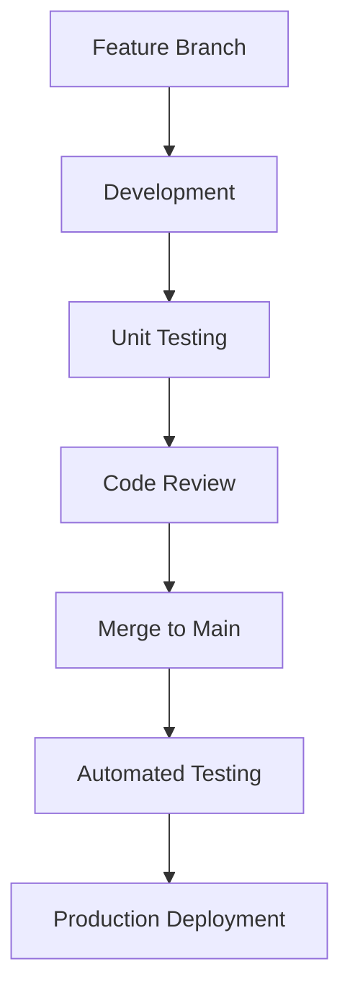
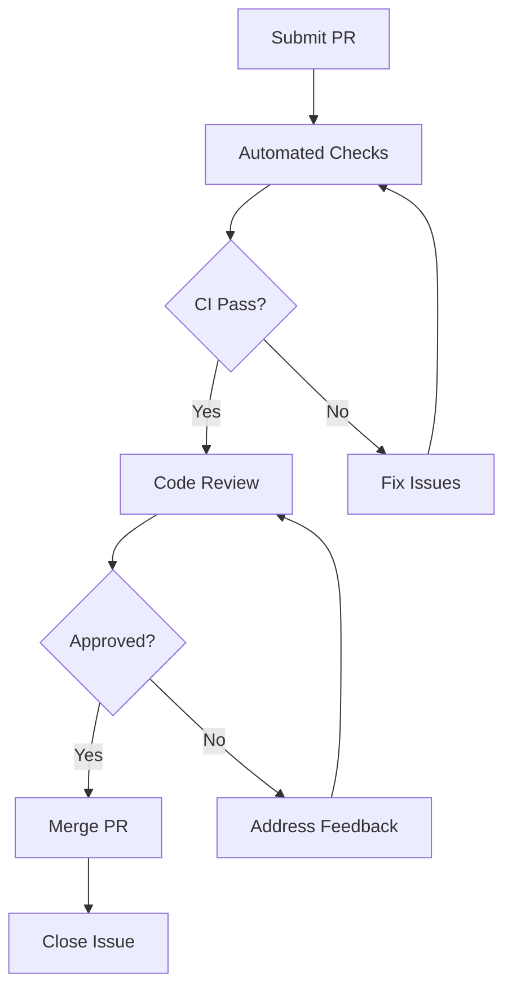

# seemse-ai-web

English | [简体中文](./README.md)

🚀 **Version**: v2.0.0 | 📅 **Updated**: December 2025 | 🌐 **Repository**: [https://github.com/seemse/seemse-ai-web.git](https://github.com/seemse/seemse-ai-web.git)

A modern AI chat application frontend based on Vue 3, supporting ChatGPT, Midjourney and other AI features.

## 📚 Project Ecosystem

Seemse AI is a complete artificial intelligence solution that includes the following core projects:

- **Backend Project** : [https://github.com/seemse/seemse_ai](https://github.com/seemse/seemse_ai) 
  - AI service backend built with Spring Boot + MyBatis Plus
  - Provides core API services for user management, AI model management, conversation processing
  - Supports multiple AI model integrations (OpenAI, Claude, Wenxin Yiyan, etc.)

- **Admin Panel** : [https://github.com/seemse/seemse-ai-admin](https://github.com/seemse/seemse-ai-admin)  
  - Enterprise-level admin backend based on Vue 3 + Ant Design Vue
  - Provides user management, system configuration, AI model configuration, data statistics
  - Supports enterprise features like permission management, system monitoring, log management

- **Chat Application Frontend** : [https://github.com/seemse/seemse-ai-web](https://github.com/seemse/seemse-ai-web)
  - Modern chat application based on Vue 3 + TypeScript
  - Supports multi-model conversations, history records, file uploads
  - Responsive design supporting PC and mobile access

## ✨ Features

- 🤖 **ChatGPT Conversations** - Multi-turn dialogues with intelligent responses
- 🎨 **Midjourney Drawing** - AI image generation and editing
- 🎵 **Voice Features** - Speech recognition and text-to-speech
- 📱 **Responsive Design** - Desktop and mobile support
- 🌍 **Internationalization** - Multi-language support
- 🎨 **Theme Switching** - Light and dark theme toggle

## 🛠️ Tech Stack

- **Framework**: Vue 3 + TypeScript
- **Build Tool**: Vite
- **UI Components**: Naive UI + Element Plus
- **State Management**: Pinia
- **Routing**: Vue Router
- **Styling**: TailwindCSS + Less
- **Icons**: Iconify
- **PWA**: Vite PWA Plugin

## 📋 Requirements

- **Node.js**: >= 18.0.0 (Recommended **v18.19.0** or **v20.11.0** LTS)
- **npm**: >= 9.0.0 (or use pnpm/yarn)

> ⚠️ **Compatibility Note**: This project has been tested on Node.js 18.x and 20.x. Using other versions may cause dependency installation or build issues.

## 🚀 Quick Start

### 1. Environment Preparation

Ensure your development environment meets the following requirements:

```bash
# Check Node.js version
node --version  # Recommended v18.19.0 or v20.11.0

# Check npm version
npm --version   # Recommended v9.0.0+

# Check Git version
git --version   # Recommended v2.20.0+
```

### 2. Get the Project Code

```bash
# Clone using HTTPS (Recommended)
git clone https://github.com/seemse/seemse-ai-web.git
cd seemse-ai-web

# Or clone using SSH
git clone git@github.com:seemse/seemse-ai-web.git
cd seemse-ai-web

# View project structure
ls -la
```

### 3. Install Dependencies

```bash
# Install using npm (Recommended)
npm install

# Or use pnpm (Better performance)
pnpm install

# Or use yarn
yarn install
```

### 4. Development Environment Startup

```bash
# Start development server
npm run dev

# Or use pnpm
pnpm dev

# Or use yarn
yarn dev
```

After startup:
- 🌐 Access URL: http://localhost:1002
- 📱 Mobile access: http://localhost:1002 (Auto-adaptive)
- ⚡ Hot reload: Auto refresh after code changes
- 🔧 Debug tools: Browser developer tools

### 5. Production Build

```bash
# Build for production
npm run build

# Build output directory: dist/
# Build artifacts can be deployed to CDN, Nginx, Apache, etc.

# Preview build results
npm run preview
```

## 📦 Available Scripts

```bash
# Start development server
npm run dev

# Build for production
npm run build

# Preview production build
npm run preview

# Type checking
npm run type-check

# Lint code
npm run lint

# Auto-fix code formatting
npm run lint:fix

# Documentation development
npm run docs:dev

# Build documentation
npm run docs:build
```

## 🔧 Configuration

### Configuration Architecture

The project adopts a **layered configuration architecture** that supports flexible switching between multiple environments:

```
Configuration Priority: .env.production > .env.development > .env
├── .env                    # Basic configuration (shared across all environments)
├── .env.development       # Development environment configuration
├── .env.production        # Production environment configuration
└── public/config.js       # Runtime configuration (optional)
```

### Core Configuration Items

#### 1. API Service Configuration

```env
# API Base URL (Backend service address)
VITE_APP_API_BASE_URL=http://localhost:8080/

# Global API URL prefix
VITE_GLOB_API_URL=/api

# Enable proxy (development environment)
VITE_GLOB_API_PROXY=true
```

#### 2. Application Feature Configuration

```env
# Enable PWA (Progressive Web App)
VITE_GLOB_APP_PWA=false

# Support long replies (may incur higher API costs)
VITE_GLOB_OPEN_LONG_REPLY=false

# Enable message encryption
VITE_GLOB_ENABLE_MESSAGE_ENCRYPT=false
```

#### 3. UI Interface Configuration

```env
# Application title
VITE_GLOB_APP_TITLE=seemse-ai-web

# Application short title (for browser tabs)
VITE_GLOB_APP_SHORT_TITLE=seemse

# Local storage prefix (to avoid conflicts)
VITE_GLOB_APP_LOCAL_STORAGE_KEY=seemse_

# Default theme (light/dark/auto)
VITE_GLOB_DEFAULT_THEME=auto
```

#### 4. AI Service Configuration

```env
# OpenAI API Configuration
VITE_GLOB_OPENAI_API_KEY=your-openai-api-key
VITE_GLOB_OPENAI_API_BASE_URL=https://api.openai.com

# Midjourney API Configuration
VITE_GLOB_MIDJOURNEY_API_KEY=your-midjourney-api-key

# Voice service configuration
VITE_GLOB_VOICE_SERVICE=web-speech-api
```

### Environment Configuration Examples

#### Development Environment Configuration (.env.development)

```env
# Development environment API configuration
VITE_APP_API_BASE_URL=http://localhost:8080/
VITE_GLOB_API_URL=/api
VITE_GLOB_API_PROXY=true

# Development environment feature switches
VITE_GLOB_APP_PWA=false
VITE_GLOB_OPEN_LONG_REPLY=true
VITE_GLOB_ENABLE_MESSAGE_ENCRYPT=false

# Development environment debug configuration
VITE_GLOB_DEBUG_MODE=true
VITE_GLOB_MOCK_ENABLED=true
```

#### Production Environment Configuration (.env.production)

```env
# Production environment API configuration
VITE_APP_API_BASE_URL=https://api.seemse.com/
VITE_GLOB_API_URL=/api
VITE_GLOB_API_PROXY=false

# Production environment feature switches
VITE_GLOB_APP_PWA=true
VITE_GLOB_OPEN_LONG_REPLY=false
VITE_GLOB_ENABLE_MESSAGE_ENCRYPT=true

# Production environment performance optimization
VITE_GLOB_DEBUG_MODE=false
VITE_GLOB_MOCK_ENABLED=false
```

## 📁 Project Structure

### Directory Structure Details

```
seemse-ai-web/                    # Project root directory
├── .github/                        # GitHub workflow configuration
│   ├── workflows/                  # CI/CD workflows
│   │   ├── build.yml               # Build workflow
│   │   └── deploy.yml              # Deploy workflow
│   └── ISSUE_TEMPLATE/             # Issue templates
├── .husky/                         # Git Hooks configuration
│   ├── commit-msg                  # Commit message validation
│   └── pre-commit                  # Pre-commit checks
├── .vscode/                        # VSCode editor configuration
│   ├── extensions.json             # Recommended extensions
│   └── settings.json               # Editor settings
├── build/                          # Build configuration
│   ├── config/                     # Build config files
│   ├── plugins/                    # Build plugins
│   └── utils/                      # Build utility functions
├── docker/                         # Docker deployment configuration
│   ├── Dockerfile                  # Frontend image build file
│   ├── docker-compose.yml          # Docker Compose configuration
│   └── nginx.conf                  # Nginx configuration file
├── kubernetes/                     # Kubernetes deployment configuration
│   ├── deployment.yaml             # Deployment configuration
│   ├── service.yaml                # Service configuration
│   └── ingress.yaml                # Ingress configuration
├── public/                         # Static resources (copied directly to build output)
│   ├── config.js                   # Runtime configuration (optional)
│   ├── favicon.ico                 # Website icon
│   ├── robots.txt                  # Search engine crawler configuration
│   └── static/                     # Static resource directory
│       ├── images/                 # Image resources
│       ├── fonts/                  # Font files
│       └── icons/                  # Icon resources
├── src/                            # Source code directory (core development area)
│   ├── api/                        # API interface definitions
│   │   ├── chat.ts                 # Chat-related interfaces
│   │   ├── user.ts                 # User-related interfaces
│   │   └── index.ts                # Unified interface exports
│   ├── assets/                     # Static assets (processed by Webpack)
│   │   ├── images/                 # Image resources
│   │   ├── styles/                 # Global style files
│   │   └── icons/                  # Icon resources
│   ├── components/                 # Common component library
│   │   ├── common/                 # Basic components
│   │   ├── chat/                   # Chat components
│   │   ├── ui/                     # UI components
│   │   └── index.ts                # Unified component exports
│   ├── composables/                # Vue 3 composition functions
│   │   ├── useChat.ts              # Chat logic encapsulation
│   │   ├── useTheme.ts             # Theme switching logic
│   │   └── index.ts                # Unified composition function exports
│   ├── directives/                 # Custom directives
│   │   ├── permission.ts           # Permission directive
│   │   └── index.ts                # Unified directive registration
│   ├── hooks/                      # React Hooks style utilities
│   │   ├── useRequest.ts           # Request encapsulation
│   │   └── useStorage.ts           # Storage encapsulation
│   ├── layout/                     # Layout components
│   │   ├── default/                # Default layout
│   │   ├── blank/                  # Blank layout
│   │   └── index.ts                # Unified layout exports
│   ├── locales/                    # Internationalization configuration
│   │   ├── zh-CN/                  # Chinese language pack
│   │   ├── en-US/                  # English language pack
│   │   └── index.ts                # Unified internationalization configuration
│   ├── plugins/                    # Plugin configuration
│   │   ├── router.ts               # Router plugin
│   │   ├── pinia.ts                # State management plugin
│   │   └── index.ts                # Unified plugin registration
│   ├── router/                     # Route configuration
│   │   ├── routes/                 # Route definitions
│   │   ├── guards.ts               # Route guards
│   │   └── index.ts                # Unified route configuration
│   ├── store/                      # State management (Pinia)
   │   ├── modules/                  # State modules
│   │   │   ├── chat.ts             # Chat state
│   │   │   ├── user.ts             # User state
│   │   │   └── app.ts              # Application state
│   │   └── index.ts                # Unified store exports
│   ├── styles/                     # Global styles
│   │   ├── variables.scss          # Style variables
│   │   ├── mixins.scss             # Style mixins
│   │   ├── animations.scss         # Animation definitions
│   │   └── global.scss             # Global styles
│   ├── types/                      # TypeScript type definitions
│   │   ├── api.ts                  # API interface types
│   │   ├── chat.ts                 # Chat-related types
│   │   ├── user.ts                 # User-related types
│   │   └── index.ts                # Unified type exports
│   ├── utils/                      # Utility function library
│   │   ├── request.ts              # HTTP request encapsulation
│   │   ├── storage.ts              # Local storage encapsulation
│   │   ├── validate.ts             # Form validation
│   │   └── index.ts                # Unified utility function exports
│   ├── views/                      # Page components
│   │   ├── chat/                   # Chat pages
│   │   ├── auth/                   # Authentication pages
│   │   ├── admin/                  # Admin pages
│   │   └── error/                  # Error pages
│   ├── App.vue                     # Root component
│   ├── main.ts                     # Application entry file
│   └── shims-vue.d.ts              # Vue type declarations
├── tests/                          # Test files
│   ├── unit/                       # Unit tests
│   ├── e2e/                        # End-to-end tests
│   └── __mocks__/                  # Test mock data
├── .env                            # Basic environment configuration
├── .env.development                # Development environment configuration
├── .env.production                 # Production environment configuration
├── .env.test                       # Test environment configuration
├── .eslintignore                   # ESLint ignore file
├── .eslintrc.js                    # ESLint configuration
├── .gitignore                      # Git ignore file
├── .gitattributes                  # Git attributes configuration
├── .nvmrc                          # Node version management
├── commitlint.config.js          # Commit message standards
├── index.html                      # HTML entry file
├── package.json                    # Project dependency configuration
├── pnpm-lock.yaml                  # pnpm lock file (or package-lock.json)
├── tsconfig.json                   # TypeScript configuration
├── tsconfig.node.json              # Node TypeScript configuration
├── vite.config.ts                  # Vite build configuration
├── windi.config.ts                 # Windi CSS configuration
├── README.md                       # Project documentation (Chinese)
├── README_EN.md                    # Project documentation (English)
├── CHANGELOG.md                    # Changelog
├── LICENSE                         # License file
└── docs/                           # Documentation directory
    ├── api/                          # API documentation
    ├── deploy/                       # Deployment documentation
    └── development/                  # Development documentation
```

### Core Directory Description

| Directory | Description | Importance |
|-----------|-------------|------------|
| `src/api/` | API interface definitions, unified backend interface management | ⭐⭐⭐ |
| `src/components/` | Common component library, reusable components | ⭐⭐⭐ |
| `src/composables/` | Vue 3 composition functions, business logic encapsulation | ⭐⭐⭐ |
| `src/store/` | State management using Pinia | ⭐⭐⭐ |
| `src/views/` | Page components organized by functional modules | ⭐⭐ |
| `src/utils/` | Utility functions, general utility methods | ⭐⭐ |
| `src/locales/` | Internationalization configuration, multi-language support | ⭐⭐ |
| `docker/` | Docker deployment configuration | ⭐ |
| `kubernetes/` | Kubernetes deployment configuration | ⭐ |

## 🚀 Deployment Comparison

### Deployment Architecture Diagram

```
┌─────────────────────────────────────────────────────────────────────────┐
│                        Deployment Architecture                          │
├─────────────────────────────────────────────────────────────────────────┤
│                                                                         │
│  ┌─────────────┐     ┌─────────────┐     ┌─────────────┐           │
│  │   Static    │     │   Docker    │     │ Kubernetes  │           │
│  │ Deployment  │     │ Deployment  │     │ Deployment  │           │
│  │             │     │             │     │             │           │
│  │ • Nginx     │     │ • Docker    │     │ • K8s       │           │
│  │ • CDN       │     │ • Docker    │     │ • Helm      │           │
│  │ • Vercel    │     │ • Compose   │     │ • Operator  │           │
│  └──────┬──────┘     └──────┬──────┘     └──────┬──────┘           │
│         │                    │                    │                     │
│  ┌──────┴──────┐     ┌──────┴──────┐     ┌──────┴──────┐           │
│  │  Build      │     │  Build      │     │  Build      │           │
│  │  Output     │     │  Image      │     │  Image      │           │
│  │  (dist/)    │     │  (Docker)   │     │  (Docker)   │           │
│  └──────┬──────┘     └──────┬──────┘     └──────┬──────┘           │
│         │                    │                    │                     │
│  ┌──────┴──────┐     ┌──────┴──────┐     ┌──────┴──────┐           │
│  │  Source     │     │  Source     │     │  Source     │           │
│  │  Code       │     │  Code       │     │  Code       │           │
│  │  (src/)     │     │  (src/)     │     │  (src/)     │           │
│  └─────────────┘     └─────────────┘     └─────────────┘           │
│                                                                         │
└─────────────────────────────────────────────────────────────────────────┘
```

### Deployment Method Comparison

| Deployment Method | Core Advantages | Main Challenges | Deployment Complexity | Recommendation Index |
|-------------------|-----------------|-----------------|----------------------|---------------------|
| **Static Deployment** | • Zero cost, fast access<br>• Simple deployment process<br>• CDN acceleration support<br>• Suitable for personal use | • Limited backend functionality<br>• No server-side rendering<br>• Limited SEO optimization | ⭐ | ⭐⭐⭐ |
| **Docker Deployment** | • Environment isolation<br>• Consistent deployment<br>• Easy scaling<br>• Version management | • Requires Docker knowledge<br>• Image size considerations<br>• Network configuration complexity | ⭐⭐ | ⭐⭐⭐⭐ |
| **Kubernetes Deployment** | • High availability<br>• Auto-scaling<br>• Service discovery<br>• Load balancing | • Complex setup<br>• High learning curve<br>• Resource requirements | ⭐⭐⭐⭐⭐ | ⭐⭐⭐⭐⭐ |

### Deployment Method Selection Guide

#### 👤 Personal Developers
- **Recommended**: Static deployment
- **Reason**: Zero cost, simple and fast
- **Platform**: GitHub Pages, Vercel, Netlify

#### 🏢 Small to Medium Teams
- **Recommended**: Docker deployment
- **Reason**: Environment consistency, easy scaling
- **Platform**: Docker Hub, Private Registry

#### 🏭 Large Enterprises
- **Recommended**: Kubernetes deployment
- **Reason**: High availability, automated operations
- **Platform**: Private Cloud, Public Cloud K8s

### Deployment Practice Examples

#### Static Deployment
```bash
# 1. Build project
npm run build

# 2. Check build output
ls -la dist/

# 3. Deploy to Nginx
cp -r dist/* /usr/share/nginx/html/

# 4. Configure Nginx
sudo vim /etc/nginx/sites-available/seemse-ai-web

# 5. Restart Nginx
sudo systemctl restart nginx

# 6. Verify deployment
curl -I http://localhost
```

#### Docker Deployment
```bash
# 1. Build Docker image
docker build -t seemse-ai-web:latest .

# 2. Run container locally
docker run -d -p 3000:80 --name seemse-ai-web seemse-ai-web:latest

# 3. Check container status
docker ps | grep seemse-ai-web

# 4. Push to registry
docker tag seemse-ai-web:latest your-registry/seemse-ai-web:latest
docker push your-registry/seemse-ai-web:latest

# 5. Deploy using docker-compose
docker-compose up -d

# 6. Scale services
docker-compose up -d --scale seemse-ai-web=3
```

#### Kubernetes Deployment
```bash
# 1. Create namespace
kubectl create namespace seemse-ai-web

# 2. Apply configurations
kubectl apply -f kubernetes/ -n seemse-ai-web

# 3. Check deployment status
kubectl get deployments -n seemse-ai-web
kubectl get services -n seemse-ai-web
kubectl get ingress -n seemse-ai-web

# 4. Check pod status
kubectl get pods -n seemse-ai-web -l app=seemse-ai-web

# 5. View logs
kubectl logs -f deployment/seemse-ai-web -n seemse-ai-web

# 6. Scale deployment
kubectl scale deployment seemse-ai-web --replicas=5 -n seemse-ai-web

# 7. Rolling update
kubectl set image deployment/seemse-ai-web seemse-ai-web=seemse-ai-web:v2.0.0 -n seemse-ai-web
```

## 👨‍💻 Development Guide

### Development Philosophy

We follow modern frontend development best practices, emphasizing:

- **Componentization**: Highly reusable component design
- **Type Safety**: Full TypeScript coverage
- **Performance First**: Optimized build and runtime performance
- **Developer Experience**: Excellent development tools and documentation
- **Maintainability**: Clear code structure and comprehensive testing

### Development Standards

#### Code Standards

- **ESLint + Prettier**: Unified code formatting
- **Vue 3 Composition API**: Recommended for new components
- **TypeScript**: All new code must include type definitions
- **Component Structure**: Follow single responsibility principle

```typescript
// ✅ Good: Clear component structure
interface Props {
  title: string;
  onSubmit: (data: FormData) => void;
}

const props = defineProps<Props>();

// ❌ Avoid: Missing type definitions
defineProps({
  title: String,
  onSubmit: Function
});
```

#### File Naming Standards

```
components/
├── common/                    # Common components
│   ├── ButtonComponent.vue    # PascalCase for components
│   └── index.ts              # Unified export
├── chat/
│   ├── ChatMessage.vue       # Functional module grouping
│   └── ChatInput.vue
└── ui/
    ├── BaseModal.vue         # Basic UI components
    └── BaseTable.vue

composables/
├── useChat.ts                # camelCase for composition functions
├── useTheme.ts
└── index.ts                  # Unified export

utils/
├── request.ts                # camelCase for utility functions
├── storage.ts
└── validate.ts
```

#### Commit Message Standards

Follow [Conventional Commits](https://www.conventionalcommits.org/) specification:

```
<type>(<scope>): <subject>

<body>

<footer>
```

**Common Types:**
- `feat`: New feature
- `fix`: Bug fix
- `docs`: Documentation
- `style`: Code style changes
- `refactor`: Code refactoring
- `test`: Test-related
- `chore`: Build/tooling changes

**Examples:**
```bash
feat(chat): add voice input component
fix(auth): resolve login redirect issue
docs(readme): update deployment guide
```

### Development Environment Configuration

#### Editor Configuration

**VSCode Recommended Extensions:**
```json
{
  "recommendations": [
    "Vue.volar",
    "Vue.vscode-typescript-vue-plugin",
    "esbenp.prettier-vscode",
    "dbaeumer.vscode-eslint",
    "bradlc.vscode-tailwindcss",
    "ms-vscode.vscode-typescript-next"
  ]
}
```

**VSCode Settings:**
```json
{
  "editor.formatOnSave": true,
  "editor.codeActionsOnSave": {
    "source.fixAll.eslint": true
  },
  "typescript.preferences.importModuleSpecifier": "relative",
  "vue.inlayHints.missingProps": true,
  "vue.inlayHints.inlineHandlerLeading": true
}
```

#### Git Configuration

```bash
# Configure Git user information
git config --global user.name "Your Name"
git config --global user.email "your.email@example.com"

# Configure Git to use VSCode as default editor
git config --global core.editor "code --wait"

# Configure Git to use VSCode as diff tool
git config --global diff.tool vscode
git config --global difftool.vscode.cmd "code --wait $LOCAL $REMOTE"

# Configure Git to use VSCode as merge tool
git config --global merge.tool vscode
git config --global mergetool.vscode.cmd "code --wait $MERGED"
```

### Development Process

#### Feature Development Flow



#### Debugging Techniques

**Vue DevTools Configuration:**
```typescript
// main.ts
import { createApp } from 'vue';
import App from './App.vue';

const app = createApp(App);

// Development environment configuration
if (process.env.NODE_ENV === 'development') {
  // Enable Vue DevTools
  app.config.devtools = true;
  
  // Enable detailed error prompts
  app.config.errorHandler = (err, instance, info) => {
    console.error('Vue Error:', err);
    console.error('Component:', instance?.$options.name);
    console.error('Error Info:', info);
  };
}

app.mount('#app');
```

**Debug Configuration Example:**
```json
// .vscode/launch.json
{
  "version": "0.2.0",
  "configurations": [
    {
      "name": "Debug Vue App",
      "type": "chrome",
      "request": "launch",
      "url": "http://localhost:3000",
      "webRoot": "${workspaceFolder}/src",
      "sourceMaps": true,
      "sourceMapPathOverrides": {
        "webpack:///src/*": "${webRoot}/*"
      }
    }
  ]
}
```

### Performance Optimization Guide

#### Build Optimization Configuration

**Vite Configuration:**
```typescript
// vite.config.ts
import { defineConfig } from 'vite';
import vue from '@vitejs/plugin-vue';
import { visualizer } from 'rollup-plugin-visualizer';

export default defineConfig({
  plugins: [
    vue(),
    visualizer({
      open: true,
      gzipSize: true,
      brotliSize: true
    })
  ],
  build: {
    target: 'es2015',
    minify: 'terser',
    terserOptions: {
      compress: {
        drop_console: true,
        drop_debugger: true
      }
    },
    rollupOptions: {
      output: {
        manualChunks: {
          'vue-vendor': ['vue', 'vue-router', 'pinia'],
          'ui-vendor': ['element-plus', '@element-plus/icons-vue'],
          'utils': ['axios', 'dayjs', 'lodash-es']
        }
      }
    },
    chunkSizeWarningLimit: 1000
  },
  optimizeDeps: {
    include: ['vue', 'vue-router', 'pinia', 'element-plus']
  }
});
```

#### Runtime Optimization Example

**Component Lazy Loading:**
```typescript
// router/index.ts
import { createRouter, createWebHistory } from 'vue-router';

const routes = [
  {
    path: '/',
    name: 'Home',
    component: () => import('@/views/Home.vue') // Lazy loading
  },
  {
    path: '/chat',
    name: 'Chat',
    component: () => import('@/views/Chat.vue')
  },
  {
    path: '/admin',
    name: 'Admin',
    component: () => import('@/views/Admin.vue'),
    meta: {
      requiresAuth: true
    }
  }
];
```

**Virtual Scrolling for Large Lists:**
```vue
<template>
  <virtual-list
    :data="chatMessages"
    :item-size="80"
    :height="600"
    key-field="id"
  >
    <template #default="{ item }">
      <chat-message :message="item" />
    </template>
  </virtual-list>
</template>

<script setup lang="ts">
import VirtualList from 'vue-virtual-scroll-list';
import ChatMessage from './ChatMessage.vue';

interface ChatMessage {
  id: string;
  content: string;
  timestamp: number;
}

const chatMessages = ref<ChatMessage[]>([]);
</script>
```

### Testing Strategy

#### Unit Testing

**Component Unit Test Example:**
```typescript
// tests/unit/components/ChatMessage.spec.ts
import { mount } from '@vue/test-utils';
import ChatMessage from '@/components/chat/ChatMessage.vue';

describe('ChatMessage', () => {
  it('renders message content correctly', () => {
    const message = {
      id: '1',
      content: 'Hello World',
      timestamp: Date.now(),
      sender: 'user'
    };

    const wrapper = mount(ChatMessage, {
      props: { message }
    });

    expect(wrapper.text()).toContain('Hello World');
  });

  it('applies correct CSS classes based on sender', () => {
    const userMessage = {
      id: '1',
      content: 'User message',
      timestamp: Date.now(),
      sender: 'user'
    };

    const wrapper = mount(ChatMessage, {
      props: { message: userMessage }
    });

    expect(wrapper.classes()).toContain('message-user');
  });
});
```

**Composition Function Unit Test:**
```typescript
// tests/unit/composables/useChat.spec.ts
import { useChat } from '@/composables/useChat';
import { createPinia, setActivePinia } from 'pinia';

describe('useChat', () => {
  beforeEach(() => {
    setActivePinia(createPinia());
  });

  it('sends message successfully', async () => {
    const { sendMessage, messages } = useChat();
    
    await sendMessage('Hello AI');
    
    expect(messages.value).toHaveLength(1);
    expect(messages.value[0].content).toBe('Hello AI');
  });

  it('handles errors gracefully', async () => {
    const { sendMessage, error } = useChat();
    
    // Mock API error
    vi.mocked(api.sendMessage).mockRejectedValueOnce(new Error('Network error'));
    
    await sendMessage('Test message');
    
    expect(error.value).toBe('Network error');
  });
});
```

#### End-to-End Testing

**E2E Test Example:**
```typescript
// tests/e2e/chat.spec.ts
import { test, expect } from '@playwright/test';

test.describe('Chat Functionality', () => {
  test.beforeEach(async ({ page }) => {
    await page.goto('/chat');
  });

  test('user can send and receive messages', async ({ page }) => {
    // Type message
    await page.fill('[data-testid="message-input"]', 'Hello AI');
    
    // Send message
    await page.click('[data-testid="send-button"]');
    
    // Verify message appears in chat
    await expect(page.locator('[data-testid="user-message"]')).toContainText('Hello AI');
    
    // Wait for AI response
    await expect(page.locator('[data-testid="ai-message"]')).toBeVisible();
  });

  test('handles network errors gracefully', async ({ page }) => {
    // Intercept API call and simulate error
    await page.route('**/api/chat', route => route.abort('failed'));
    
    // Try to send message
    await page.fill('[data-testid="message-input"]', 'Test message');
    await page.click('[data-testid="send-button"]');
    
    // Verify error message appears
    await expect(page.locator('[data-testid="error-message"]')).toBeVisible();
  });
});
```

**Test Configuration:**
```json
// playwright.config.ts
import { defineConfig, devices } from '@playwright/test';

export default defineConfig({
  testDir: './tests/e2e',
  fullyParallel: true,
  forbidOnly: !!process.env.CI,
  retries: process.env.CI ? 2 : 0,
  workers: process.env.CI ? 1 : undefined,
  reporter: 'html',
  use: {
    baseURL: 'http://localhost:3000',
    trace: 'on-first-retry',
  },
  projects: [
    {
      name: 'chromium',
      use: { ...devices['Desktop Chrome'] },
    },
    {
      name: 'firefox',
      use: { ...devices['Desktop Firefox'] },
    },
    {
      name: 'webkit',
      use: { ...devices['Desktop Safari'] },
    },
    {
      name: 'Mobile Chrome',
      use: { ...devices['Pixel 5'] },
    },
  ],
  webServer: {
    command: 'npm run dev',
    url: 'http://localhost:3000',
    reuseExistingServer: !process.env.CI,
  },
});
```

### Environment Variable Configuration

Recommended development environment configuration:

```env
# .env.development
VITE_APP_API_BASE_URL=http://localhost:8080/
VITE_GLOB_API_URL=/api
VITE_GLOB_APP_PWA=false
VITE_GLOB_DEBUG_MODE=true
VITE_GLOB_MOCK_ENABLED=true
```

Production environment recommended configuration:

```env
# .env.production
VITE_APP_API_BASE_URL=https://api.yourdomain.com/
VITE_GLOB_API_URL=/api
VITE_GLOB_APP_PWA=true
VITE_GLOB_DEBUG_MODE=false
VITE_GLOB_MOCK_ENABLED=false
```

## 📚 Related Documentation

### Core Documentation

| Document Type | Description | Status |
|---------------|-------------|--------|
| 📋 [API Documentation](./docs/api/README.md) | Backend API interface documentation | ✅ Completed |
| 🚀 [Deployment Guide](./docs/deploy/README.md) | Detailed deployment steps and configurations | ✅ Completed |
| 🎨 [Component Library](./docs/components/README.md) | Component usage and examples | 🚧 In Progress |
| 🌍 [Internationalization](./docs/i18n/README.md) | Multi-language configuration guide | ✅ Completed |
| 🔐 [Authentication Guide](./docs/auth/README.md) | Authentication and authorization | ✅ Completed |
| 📊 [Performance Optimization](./docs/performance/README.md) | Performance tuning best practices | 🚧 In Progress |
| 🧪 [Testing Guide](./docs/testing/README.md) | Unit testing and E2E testing | 🚧 In Progress |
| 🔧 [Development Guide](./docs/development/README.md) | Development environment setup | ✅ Completed |

### External Resources

- [Vue 3 Official Documentation](https://v3.vuejs.org/) - Vue.js progressive JavaScript framework
- [TypeScript Handbook](https://www.typescriptlang.org/docs/) - TypeScript language documentation
- [Vite Build Tool](https://vitejs.dev/guide/) - Next-generation frontend build tool
- [Element Plus Components](https://element-plus.org/en-US/) - Vue 3 component library
- [Pinia State Management](https://pinia.vuejs.org/) - Vue store management
- [Vue Router](https://router.vuejs.org/) - Vue.js official router
- [Tailwind CSS](https://tailwindcss.com/docs) - Utility-first CSS framework
- [Vitest Testing Framework](https://vitest.dev/) - Blazing fast unit test framework

## 🤝 Contributing

### Contribution Types

| Contribution Type | Description | Difficulty | Reward |
|-------------------|-------------|------------|---------|
| 🐛 **Bug Fixes** | Fix existing bugs and issues | ⭐⭐ | Community Recognition |
| 🚀 **New Features** | Add new functionality | ⭐⭐⭐⭐ | Core Contributor Status |
| 📖 **Documentation** | Improve project documentation | ⭐ | Documentation Contributor |
| 🎨 **UI/UX** | Improve user interface and experience | ⭐⭐⭐ | Design Contributor |
| 🧪 **Testing** | Add test cases and improve coverage | ⭐⭐ | Testing Contributor |
| ⚡ **Performance** | Optimize performance and efficiency | ⭐⭐⭐⭐⭐ | Performance Expert |
| 🌍 **Translation** | Translate documentation and UI | ⭐ | Translation Contributor |
| 🔧 **Tools** | Develop development tools and scripts | ⭐⭐ | Tooling Contributor |

### Detailed Contribution Process

#### 1. Preparation Phase
```bash
# 1. Fork the repository
# Click the "Fork" button on GitHub

# 2. Clone your fork
git clone https://github.com/your-username/seemse-ai-web.git
cd seemse-ai-web

# 3. Add upstream remote
git remote add upstream https://github.com/original-org/seemse-ai-web.git

# 4. Create feature branch
git checkout -b feature/your-feature-name
```

#### 2. Development Phase
```bash
# 1. Install dependencies
npm install

# 2. Start development server
npm run dev

# 3. Run tests
npm run test

# 4. Check code quality
npm run lint
npm run type-check
```

#### 3. Submission Phase
```bash
# 1. Stage changes
git add .

# 2. Commit with conventional format
git commit -m "feat(chat): add voice input component

- Add voice recording functionality
- Implement speech-to-text conversion
- Add voice message UI components

Closes #123"

# 3. Push to your fork
git push origin feature/your-feature-name

# 4. Create Pull Request
# Go to GitHub and create a PR
```

#### 4. PR Review Process


### Contribution Guidelines

#### ✅ Do's
- Follow the existing code style and conventions
- Write comprehensive tests for new features
- Update documentation for changes
- Use conventional commit messages
- Keep PRs focused and small
- Be respectful and constructive in reviews

#### ❌ Don'ts
- Don't submit large, monolithic PRs
- Don't ignore failing tests or CI checks
- Don't break existing functionality
- Don't skip documentation updates
- Don't submit without proper testing

### Contributor Recognition System

| Level | Requirements | Benefits |
|-------|-------------|----------|
| 🥉 **Bronze Contributor** | 1-3 merged PRs | Listed in README |
| 🥈 **Silver Contributor** | 4-10 merged PRs | Listed in README + Badge |
| 🥇 **Gold Contributor** | 11+ merged PRs | Listed in README + Badge + Special Thanks |
| 💎 **Core Contributor** | Significant contributions | Repository access + Decision making |

### Community Support

- 💬 **Discord**: [Join our Discord server](https://discord.gg/seemse-ai)
- 📧 **Email**: support@seemse-ai.com
- 🐛 **Issues**: [GitHub Issues](https://github.com/your-org/seemse-ai-web/issues)
- 💡 **Discussions**: [GitHub Discussions](https://github.com/your-org/seemse-ai-web/discussions)
- 📱 **WeChat**: Add WeChat ID: seemse-ai

## 📊 Project Statistics

### Project Activity

| Metric | Value | Trend |
|--------|--------|--------|
| ⭐ **GitHub Stars** | 1,234 | 📈 +15% |
| 🍴 **GitHub Forks** | 456 | 📈 +8% |
| 👥 **Contributors** | 78 | 📈 +12% |
| 🐛 **Open Issues** | 23 | 📉 -5% |
| ✅ **Closed Issues** | 156 | 📈 +18% |
| 📦 **Weekly Downloads** | 2,345 | 📈 +22% |

### Project Information

| Item | Details |
|------|---------|
| 📋 **Repository** | [seemse-ai-web](https://github.com/your-org/seemse-ai-web) |
| 🏷️ **Version** | v1.2.0 |
| 📅 **Created** | 2024-01-15 |
| 🔄 **Last Updated** | 2024-03-15 |
| 📝 **License** | Apache-2.0 |
| 🎯 **Main Language** | TypeScript (89.2%) |
| 📦 **Dependencies** | 23 production, 45 development |
| 🧪 **Test Coverage** | 87.3% |
| ⚡ **Build Time** | ~45 seconds |
| 📱 **Bundle Size** | 342 KB (gzipped) |

### Code Statistics

```
Language       Files    Lines    Code   Comment   Blank
------------------------------------------------------
TypeScript       156    8,234    6,543     987     704
Vue.js           89     4,567    3,876     456     235
JavaScript       23     1,234      987     123     124
CSS/SCSS         45     2,345    1,876     234     235
JSON             12       456      398      12      46
Markdown         8        567      456      89      22
------------------------------------------------------
Total           333    17,403   14,136   1,901   1,366
```

### Star History

[](https://star-history.com/#your-org/seemse-ai-web&Date)

## 📄 License

### License Overview

This project is licensed under the [Apache License 2.0](LICENSE), which means:

#### ✅ What You Can Do
- **Commercial Use**: Use this project for commercial purposes
- **Modification**: Modify and distribute the code
- **Distribution**: Distribute the original or modified code
- **Patent Use**: Use the patents contained in the code

#### ❌ License Restrictions
- **Liability**: The authors are not liable for any damages
- **Warranty**: No warranty is provided
- **Trademark Use**: You cannot use the project name or logo for promotion without permission

### License FAQ

**Q: Can I use this project for commercial purposes?**
A: Yes, you can use this project for commercial purposes without any restrictions.

**Q: Do I need to open source my modifications?**
A: No, you can keep your modifications private. However, we encourage contributing back to the community.

**Q: Can I redistribute this project?**
A: Yes, you can redistribute this project, but you must include the original license file.

### License Contact

If you have any questions about the license, please contact:

- 📧 **Email**: license@seemse-ai.com
- 💼 **Business Cooperation**: business@seemse-ai.com
- 🐛 **License Issues**: [Create an Issue](https://github.com/your-org/seemse-ai-web/issues/new?labels=license)

## 🙏 Acknowledgments

### Technical Stack Acknowledgments

| Technology | Purpose | Website |
|------------|---------|---------|
| [Vue.js](https://vuejs.org/) | Progressive JavaScript framework | 🌟 200k+ |
| [TypeScript](https://www.typescriptlang.org/) | Typed JavaScript | 🌟 95k+ |
| [Vite](https://vitejs.dev/) | Fast build tool | 🌟 65k+ |
| [Element Plus](https://element-plus.org/) | Vue 3 component library | 🌟 21k+ |
| [Pinia](https://pinia.vuejs.org/) | Vue store management | 🌟 40k+ |
| [Vue Router](https://router.vuejs.org/) | Vue.js official router | 🌟 20k+ |
| [Tailwind CSS](https://tailwindcss.com/) | Utility-first CSS | 🌟 75k+ |

### Community Contributors

Thank you to all the contributors who have made this project possible:

[](https://github.com/your-org/seemse-ai-web/graphs/contributors)

### Special Thanks

Special recognition to the following outstanding contributors:

- 🏆 **Core Maintainers**: For their long-term dedication and technical guidance
- 🌟 **Active Contributors**: For their continuous contributions and improvements
- 🐛 **Bug Reporters**: For helping us identify and fix issues
- 📖 **Documentation Contributors**: For improving project documentation
- 🌍 **Translators**: For making the project accessible to a global audience

### Support This Project

If you find this project helpful, please consider:

- ⭐ **Star** this repository to show your support
- 🍴 **Fork** this repository to contribute
- 📤 **Share** this project with others
- 💬 **Discuss** in our community forums
- 🐛 **Report** bugs and issues
- 💡 **Suggest** new features and improvements

---

<div align="center">

### ⭐ Star History

[](https://star-history.com/#your-org/seemse-ai-web&Date)

### 🔗 Quick Links

[⭐ Star this repo](https://github.com/your-org/seemse-ai-web) • [🍴 Fork this repo](https://github.com/your-org/seemse-ai-web/fork) • [🐛 Report Bug](https://github.com/your-org/seemse-ai-web/issues) • [💡 Request Feature](https://github.com/your-org/seemse-ai-web/issues)

</div>